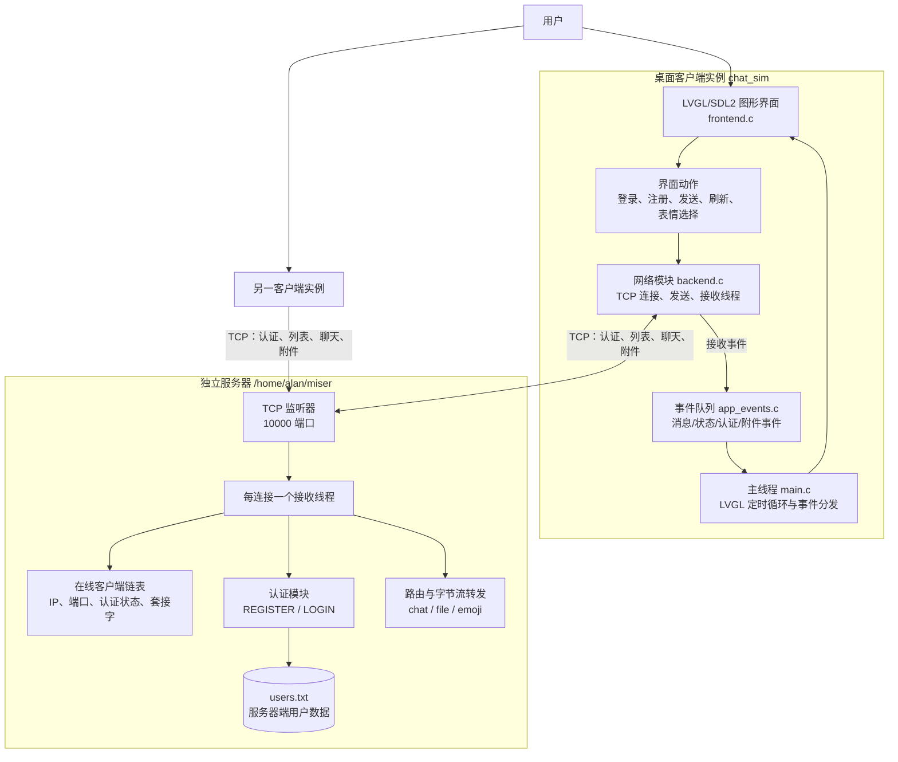

# Michat 即时通信系统项目验收总结

> 项目名称：**Michat 桌面即时通信系统**  
> 当前验收范围：基于 WSL/Linux 的桌面客户端与独立 TCP 服务器  

## 一、设计目标

Michat 面向局域网或同主机网络环境，完成一个具有图形界面的轻量级即时通信系统。项目以 C 语言实现，客户端采用 LVGL 与 SDL2 构建桌面界面，服务器采用 TCP Socket 和多线程机制提供接入、认证与消息转发服务。

设计时重点考虑以下目标：

1. **实现基本通信闭环。** 用户能够注册、登录、查看在线客户端、选择会话对象并进行定向文字交流。
2. **保证身份认证的前后端分离。** 客户端只提交用户名和密码并根据结果切换界面；用户名、密码的存储与真实性校验均由服务器完成，客户端不保存用户数据库，也不内置账号密码。
3. **支持多客户端并行运行。** 每次启动客户端时由操作系统分配可用本地端口，避免固定端口冲突；账号密码用于认证，网络端点用于消息路由。
4. **丰富消息表达形式。** 在不改变文字聊天语义的前提下，支持普通文件发送、项目内表情选择、图片/表情预览与接收文件落盘。
5. **保证界面可用性。** 提供登录/注册切换、在线列表、会话切换、状态提示、聊天气泡、收发双方头像及图片等可视化反馈。
6. **保持模块可维护。** 将界面、网络、主线程事件投递、服务器端认证和转发职责拆分，为后续扩展注销、修改密码、用户资料、权限控制等功能预留清晰边界。

## 二、功能描述

| 功能类别 | 已实现内容 | 实现要点 |
|---|---|---|
| 用户注册与登录 | 注册新用户、登录校验、注册后返回登录页、登录成功后进入聊天室 | 客户端发送 `REGISTER`/`LOGIN` 请求；服务器返回明确成功或失败结果并决定认证状态 |
| 在线用户管理 | 获取在线列表、展示“用户名 + IP:端口”、点击后创建/切换会话 | 服务器只向已认证客户端提供用户名与端点；客户端用用户名展示、用 IP 与端口维护会话对象和未读提示 |
| 文字聊天 | 输入文字、定向发送、接收显示、状态反馈 | 使用独立 `chat` 命令；发送和接收消息按不同方向显示气泡 |
| 多客户端运行 | 重复启动多个独立客户端窗口 | 未设置 `CHAT_LOCAL_PORT` 时绑定端口 0，由操作系统分配空闲临时端口；VS Code 任务允许并行启动多个实例 |
| 普通文件传输 | 指定目标、发送文件、接收端保存并提示文件信息 | 使用独立 `file` 命令，服务器按文件长度转发字节流；接收文件保存到 `build/runtime/received/` |
| 表情与图片 | 从 `assets/emojis/` 选择图片表情、发送与接收预览、聊天图片气泡 | 表情使用独立 `emoji` 命令；PNG/JPG/JPEG/BMP 可在满足解码条件时显示，单个预览文件上限为 5 MB，并按比例限制显示尺寸 |
| 聊天界面识别 | 发送方/接收方头像、左右消息布局、会话标题及状态栏 | 自己的消息位于右侧并使用蓝色 `ME` 头像；对方消息位于左侧，头像旁、会话标题和会话列表均优先显示服务器认证后的用户名 |

## 三、设计方案

### 3.1 客户端方案

客户端由四个协作模块构成：

- **界面层（`frontend.c`）**：使用 LVGL 生成登录注册页和聊天室页面，处理按钮、输入框、会话、在线列表、消息气泡、文件控件及表情选择器。
- **网络层（`backend.c`）**：建立 TCP 连接，完成本地端口申请、认证请求、聊天请求、在线列表请求、文件/表情字节流收发，并通过互斥锁保护共享套接字。
- **事件桥接层（`app_events.c`）**：网络接收线程不直接操作 LVGL 控件，而是将消息、状态、认证结果、在线列表和附件事件写入一个受互斥锁保护的环形队列；主线程定期取出并刷新界面。
- **程序入口（`main.c`）**：初始化 LVGL、SDL 窗口、鼠标和键盘输入；注册前端动作和后端回调；驱动主事件循环。

这种组织方式将网络阻塞操作与界面绘制隔离，避免接收线程直接修改 GUI 造成线程安全问题。

### 3.2 服务器方案

服务器位于 `/home/alan/miser`，默认监听 TCP 10000 端口。其核心设计如下：

- 使用监听套接字接收连接，并为每个客户端建立一个在线链表节点；
- 每个连接由一个分离线程接收和解析协议；
- 用户名与密码保存于服务器端 `users.txt`，注册、登录操作在互斥锁保护下完成；
- 仅登录认证成功的连接能够获取在线列表、发送聊天消息或传输附件；服务器将登录用户名绑定到连接，并在在线列表中返回该用户名；
- 根据目标 IP 和端口查询在线链表，将文字控制信息或文件/表情字节流转发给目标客户端；
- 客户端断开时关闭套接字并删除对应在线节点，避免离线端点残留在在线列表中。

### 3.3 协议与数据处理方案

认证与聊天/附件协议分开设计，避免认证功能干扰既有聊天语义：

| 业务 | 客户端请求/服务器响应示例 | 处理说明 |
|---|---|---|
| 注册 | `REGISTER@用户名@密码` → `REGISTER_OK` / `REGISTER_FAIL` | 服务器检查格式与用户名唯一性后写入用户库 |
| 登录 | `LOGIN@用户名@密码` → `LOGIN_OK` / `LOGIN_FAIL` | 服务器认证成功后标记当前连接为已认证 |
| 在线列表 | `getlist` → `getlist#用户名@IP:端口#...` | 仅返回已认证的在线连接；客户端展示为“用户名  IP:端口”，但内部仍以端点路由 |
| 文字消息 | `chat@目标IP@目标端口@消息` | 服务器转发为带发送方端点的聊天记录 |
| 普通文件 | `file@目标IP@目标端口@路径@类型@长度` + 二进制数据 | 服务器先转发文件头，再按长度循环转发字节流 |
| 表情图片 | `emoji@目标IP@目标端口@路径@图片类型@长度` + 二进制数据 | 与普通文件使用独立命令，接收端按图片类型尝试预览 |

## 四、系统框架

### 框架运行说明

1. 客户端启动后创建 SDL 窗口，并由后台连接线程请求一个本地空闲端口、连接服务器和上报会话端点。
2. 用户完成登录后，服务器将该连接标记为已认证；客户端隐藏认证页面并显示聊天室。
3. 用户刷新在线列表或选择目标对象后，客户端按目标端点发送定向消息/附件请求。
4. 服务器维护在线链表并完成路由；接收方网络线程将结果转为事件，再由 GUI 主线程显示为消息、图片或文件提示。

## 五、实现过程

1. **梳理原有通信模型。** 保留 TCP 连接、客户端/服务器线程模型、在线链表和已有聊天消息格式，在其基础上补充认证与附件展示能力，避免大规模替换聊天模块。
2. **完成图形客户端搭建。** 使用 LVGL 创建 960×640 的桌面聊天窗口，并以 SDL2 提供窗口、鼠标和键盘输入支持；CMake 负责配置和构建 `chat_sim`。
3. **实现认证闭环。** 客户端增加登录/注册界面和输入校验；服务器增加用户文件、凭据校验、互斥锁及认证结果响应。聊天功能仅在服务器确认登录后开放。
4. **处理多客户端端口冲突。** 将默认本地绑定端口调整为 0，由操作系统自动分配；窗口标题显示实际端口，便于测试时区分多个客户端。
5. **实现会话与在线列表。** 客户端将在线端点转换为可选择的会话对象，维护当前会话、未读数与消息区域；服务器在连接断开时同步移除在线节点。
6. **实现文件和表情功能。** 普通文件和表情采用独立命令，服务器只负责转发；接收端统一保存附件，图片类型通过 LVGL 解码器以等比例气泡显示。表情选择器只读取项目 `assets/emojis/` 目录，避免用户手工输入表情路径。
7. **优化聊天呈现。** 增加自我与对方的左右气泡、头像、图片最大预览尺寸与自动滚动，使文字、图片和表情均能在会话区域中完整可辨。
8. **构建与验证。** 使用 Native WSL GCC 预设构建桌面程序；已完成桌面客户端重新构建、并行客户端端口分配、认证协议、附件路由和图片预览等针对性检查。

## 六、测试与验收要点

建议验收时按以下顺序演示：

1. 启动服务器，再通过 VS Code 连续运行两个 `chat_sim` 实例，观察两个窗口标题中的本地端口不同。
2. 使用第一个客户端注册新账号；注册成功后返回登录界面并使用该账号登录。
3. 使用第二个客户端注册/登录另一账号，刷新在线列表；双方应能看到彼此的“用户名  IP:端口”。
4. 选中目标会话后互发文字，检查“自己右侧、对方左侧”的头像和气泡显示，以及对方用户名显示。
5. 从 `assets/emojis/` 中选择表情发送，确认双方均显示完整图片；再发送普通文件，确认接收端保存提示与文件路径。
6. 关闭一个客户端并刷新另一客户端的在线列表，确认已断开的端点不再显示。

## 七、心得体会

本项目的关键不只是完成界面绘制，而是使界面、网络和服务器状态形成可靠闭环。实现过程中体会到以下几点：

1. **职责边界决定系统可维护性。** 认证数据必须由服务器保存和判断，客户端只负责输入、请求和结果展示，才能避免“假登录”或多个客户端数据不一致的问题。
2. **GUI 与网络线程必须隔离。** 网络线程直接修改 LVGL 控件容易产生并发问题。通过事件队列将网络事件转交主线程处理，既保持界面响应，也使程序结构更清晰。
3. **协议扩展要兼顾兼容性。** 表情和文件虽然都传输二进制数据，但采用独立命令，有利于保持文字聊天协议语义稳定，也便于接收端选择不同展示方式。
4. **测试应覆盖真实使用场景。** 多窗口同时运行、注册后登录、上线/离线刷新、图片尺寸限制和收发双方显示，比单独检查某个函数更能反映系统是否可用。
5. **后续可继续完善。** 当前用户库为教学场景下的轻量文本存储。若进一步工程化，可增加密码哈希、传输加密、文件大小限制、用户昵称/头像持久化、异常重连、日志审计和更完善的权限控制。

## 八、项目文件对应关系

| 文件/目录 | 主要职责 |
|---|---|
| `main.c` | LVGL/SDL2 初始化、输入设备、事件循环与回调绑定 |
| `frontend.c`、`frontend.h` | 登录注册、聊天室、会话、在线列表、消息气泡、头像、图片与表情界面 |
| `backend.c`、`backend.h` | TCP 连接、协议封装、认证请求、文字/附件收发、本地端口分配 |
| `app_events.c`、`app_events.h` | 网络线程到 GUI 主线程的事件队列 |
| `assets/emojis/` | 客户端表情图片资源 |
| `assets/send_files/` | 普通文件发送测试目录 |
| `build/runtime/received/` | 客户端运行时接收附件保存目录 |
| `/home/alan/miser/server.c` | TCP 服务器、认证、在线链表和消息/附件转发 |
| `/home/alan/miser/users.txt` | 服务器端用户注册信息存储文件 |
